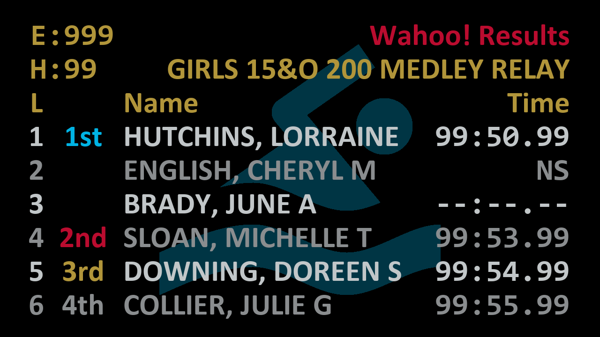

# Wahoo! Results

Wahoo! Results is a scoreboard for displaying swimming meet race results.

If you are looking for a way to have a scoreboard to display race results and
you use either Meet Manager or Meet Maestro plus a CTS Dolphin system to run
your meets, this may be for you!

:arrow_right: [Download the latest version
here](https://github.com/JohnStrunk/wahoo-results/releases/latest) :arrow_left:

## Requirements

- Meet management software - Used to generate the scoreboard "start list" files
  - Hy-Tek Meet Manager
  - SwimTopia Meet Maestro
- Colorado Dolphin timing - Used to gather the timing information
- A Windows PC to run Wahoo! Results

## Features

- Configurable number of lanes: 6 - 10
- Customizable text fonts, sizes, and colors
- Custom background images, or just use a solid color
- Calculates final time based on multiple Dolphin watches
- Broadcasts the scoreboard to 1 or more Chromecast devices

## Installation

Download the latest version of `wahoo-results.exe` from the [releases
page](https://github.com/JohnStrunk/wahoo-results/releases).

The program a single executable w/ no installation necessary. Configuration
preferences are saved into a `wahoo-results.ini` file in the same directory.

Once you've downloaded the application, make sure to [read the
documentation](https://wahoo-results.com/).

## How it works

1. Once the meet has been seeded in your meet management software, export "CTS
   start list" files as you would for a normal scoreboard.
1. Use Wahoo! Results to generate the event file for the Dolphin software
   based on the start list files.
1. Configure Wahoo! Results to watch for the Dolphin `*.do4` race result
   files.
1. When new race result files are created by the Dolphin, Wahoo Results will
   display race results including both names (from the start list files) and
   times (from the Dolphin result files) onto one or more Chromecast devices
   on the local network.

## License

This software is licensed under the GNU Affero General Public License
version 3. See the [LICENSE](LICENSE) file for full details.  
The documentation &copy; 2020 &ndash; 2024 by John Strunk is licensed under
[Creative Commons Attribution-ShareAlike 4.0 International (CC BY-SA
4.0)](http://creativecommons.org/licenses/by-sa/4.0/)
