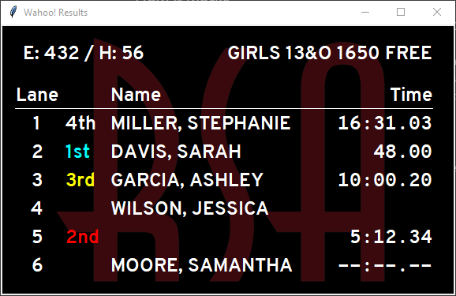

# Wahoo! Results

Wahoo! Results is a scoreboard for displaying swimming meet race results.

If you are looking for a way to have a scoreboard to display race results and
you use Meet Manager + a CTS Dolphin system to run your meets, this may be for
you!

:arrow_right: [Download the latest version
here](https://github.com/JohnStrunk/wahoo-results/releases/latest) :arrow_left:

## Requirements

- Hy-Tek Meet Manager - Used to generate the scoreboard "start list" files
- Colorado Dolphin timing - Used to gather the timing information
- A Windows PC to run Wahoo! Results

## Features

- Configurable number of lanes: 6 - 10
- Customizable text fonts, sizes, and colors
- Custom background images, or just use a solid color
- Calculates final time based on multiple Dolphin watches
- Broadcasts the scoreboard to 1 or more Chromecast devices

## Installation

Download the latest version of `wahoo-results.exe` from the [releases
page](https://github.com/JohnStrunk/wahoo-results/releases).

The program a single executable w/ no installation necessary. Configuration
preferences are saved into a `wahoo-results.ini` file in the same directory.

## How it works

1. Once the meet has been seeded in Meet Manager, export CTS start list files
   as you would for a normal scoreboard.
2. Use Wahoo! Results to generate the event file for the Dolphin software
   based on the start list files.
3. Configure Wahoo! Results to watch for the Dolphin `*.do4` race result
   files.
4. Run the scoreboard. It will display race results including both names (from
   the start list files) and times (from the Dolphin result files) onto
   Chromecast devices on the local network.

## License

This software is licensed under the GNU Affero General Public License version
3. See the [LICENSE](LICENSE) file for full details.

## Changelog

The format is based on [Keep a Changelog](https://keepachangelog.com/en/1.0.0/)

### [Unreleased]

#### Added

- :sparkles: Application now has a startup splash screen
- :sparkles: Waiting screen now uses the specified background image

#### Changed

- :information_source: Application now has a new icon
- :information_source: Executable is now built w/ UPX enabled to decrease the
  size of the binary.

### [0.6.2] - 2022-05-14

#### Fixed

- :bug: Properly disconnect from Chromecasts when probing to prevent leaking
  threads

### [0.6.1] - 2022-01-17

#### Fixed

- :bug: Catch and report errors if config file isn't writable

### [0.6.0] - 2021-08-15

#### Added

- :sparkles: Added new screen to manually select a previous result, change its
  event/heat and re-publish it.
- :sparkles: Integrated Sentry.io for crash reporting

### [0.5.0] - 2021-07-24

#### Added

- :sparkles: The scoreboard now has Chromecast support.
- :sparkles: The latest results are shown in the application.

#### Fixed

- :bug: The text file encoding for `scb`, `do4`, and `csv` files was left
  unspecified, which potentially led to decoding problems when non-ASCII
  characters were encountered. `cp1252` is now specified directly.

#### Removed

- :skull_and_crossbones: Removed support for "windowed" and full screen (on an
  attached monitor) scoreboard output

### [0.4.1] - 2021-06-19

#### Fixed

- :bug: Fixed parsing of do4 file containing empty event number. This caused
  the scoreboard to stop displaying results after an empty event number was
  encountered.

### [0.4.0] - 2021-04-24

#### Added

- :sparkles: Add update notification

#### Changed

- :information_source: Releases will now be signed zips instead of bare exe files to avoid warnings on download and allow authentication of releases

### [0.3.2] - 2021-01-16

#### Fixed

- :bug: Fixed fullscreen only working on primary display
- :bug: Fixed hang when background image is not found

### [0.3.1] - 2020-12-04

#### Fixed

- :bug: Fixed handling of bool as int

### [0.3.0] - 2020-12-03

#### Added

- :sparkles: Option to suppress final time if the individual times have >0.3s spread
- :sparkles: Option to run the scoreboard in fullscreen mode

#### Fixed

- :bug: Properly display results when start list file is missing
- :bug: Fix incorrect final time calculation

### [0.2.0] - 2020-10-25

#### Added

- :sparkles: Number of lanes can be customized within the application
- :sparkles: Many new scoreboard configuration options: Fonts, colors, and background image
- :sparkles: Custom colors for 1st-3rd place
- :sparkles: Test button to show a scoreboard mockup demonstrating the current customization settings

#### Changed

- :information_source: (internal) Switched from using widgets for the scoreboard to placing text on a Canvas object

#### Fixed

- :bug: There were instances where the incorrect final time was calculated due to imprecision in floating point arithmetic

### [0.1.0] - 2020-09-06

#### Added

- Initial release

[Unreleased]: https://github.com/JohnStrunk/wahoo-results/compare/v0.6.2...HEAD
[0.6.2]: https://github.com/JohnStrunk/wahoo-results/compare/v0.6.1...v0.6.2
[0.6.1]: https://github.com/JohnStrunk/wahoo-results/compare/v0.6.0...v0.6.1
[0.6.0]: https://github.com/JohnStrunk/wahoo-results/compare/v0.5.0...v0.6.0
[0.5.0]: https://github.com/JohnStrunk/wahoo-results/compare/v0.4.1...v0.5.0
[0.4.1]: https://github.com/JohnStrunk/wahoo-results/compare/v0.4.0...v0.4.1
[0.4.0]: https://github.com/JohnStrunk/wahoo-results/compare/v0.3.2...v0.4.0
[0.3.2]: https://github.com/JohnStrunk/wahoo-results/compare/v0.3.1...v0.3.2
[0.3.1]: https://github.com/JohnStrunk/wahoo-results/compare/v0.3.0...v0.3.1
[0.3.0]: https://github.com/JohnStrunk/wahoo-results/compare/v0.2.0...v0.3.0
[0.2.0]: https://github.com/JohnStrunk/wahoo-results/compare/v0.1.0...v0.2.0
[0.1.0]: https://github.com/JohnStrunk/wahoo-results/releases/tag/v0.1.0
