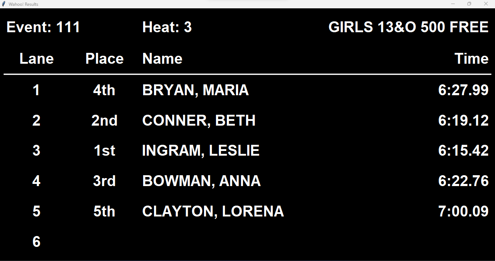
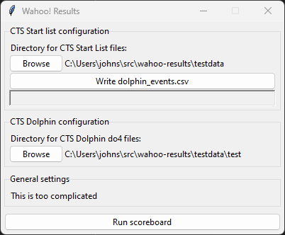
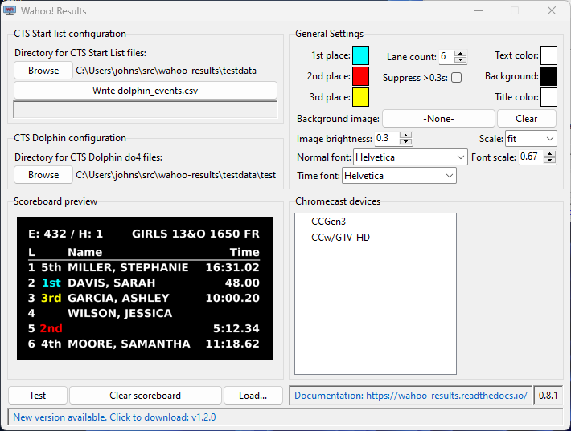
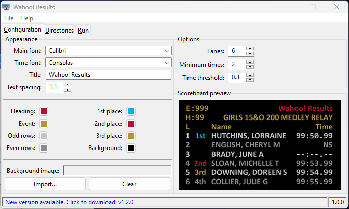

---
authors:
  - JohnStrunk
date: 2023-10-30
draft: true
---

# The history of {{ WR }}

Everything of significance has an origin story: Superman, Spider-Man, even SWIMS
3.0. This is the origin story of {{ WR }} — why I wrote it, how it has
evolved, and some of the lessons I’ve learned during the process.

<!-- more -->

## Introduction

Sometimes a project is just a small one. It’s not too complicated; it’s designed
to solve a specific, well-defined use-case, and it has a specific end-state
(e.g., building a bookshelf). Other times, something that starts as a small
project turn into more of an ongoing hobby. As the project progresses and starts
to show value, the scope expands, and it evolves over time.

{{ WR }} started as one of those “I think I can throw something together
to solve a problem” projects and became a fun “I wonder what I should add next”
project.

## Where it started

Everything started (or ended, I suppose) with COVID. During the summer of 2020,
lots of folks had extra time on their hands. Some learned knitting, others how
to [skip rope](https://www.instagram.com/lauren.jumps). In my case, I built a
swimming scoreboard.

At the time, my family was swimming with [Raleigh Swimming
Association](https://www.swimrsa.org/page/home) — that’s the RSA Wahoos, by the
way. Now you know where the name came from.

As we got into the summer of 2020, restrictions eased a bit, practices resumed,
and we started having small intrasquad meets. The team had just purchased a set
of Dolphin watches a few months prior, so we now had electronic timing, but no
way to display the results.

There happened to be a large TV on deck that was periodically used for
instruction or to review swimming footage, so at one of these meets, I brought
an [AnyCast](https://any-cast.com/) device and proceeded to mirror the Dolphin
window to the TV— I mean, why not show some times, right? Well, it turned out to
be a big hit with both the swimmers and the coaches. Everyone enjoyed seeing the
results at the end of the race.

To make it more “scoreboard-ish”, I wrote a quick program
[events2dolphin](https://github.com/JohnStrunk/events2dolphin) that would take a
start list and write the event list to CSV for the Dolphin software. This meant
that at the next meet, we had the event name and heat displayed on our makeshift
“scoreboard.”

## Evolution of the scoreboard

Having just started with Python programming, I was looking for a good project to
build some experience. It seemed to have the pre-requisites I was looking for in
building a real scoreboard:

- I could build a Windows executable (and not rely on Python + libraries being
  installed)
- Python has an extensive library ecosystem
- It includes a library for developing GUIs (tkinter)

### The early days

<figure markdown>
  { width=1366 height=721 }
  <figcaption>Scoreboard v0.1.0</figcaption>
</figure>

<figure markdown>
  { width=402 height=332 }
  <figcaption>Config screen v0.1.0</figcaption>
</figure>

The first iteration lacked a bit of polish, to say the least… Shown here is the
first tagged version of the code. I was just happy to be able to get the text up
on the screen at this point. The app had a minimal set of configuration options,
and the scoreboard was just displayed in a window that the user had to maximize
and display on the TV (again, via the AnyCast).

With each meet, I added a few more features. Version 0.2.0 added some color to
the scoreboard. Version 0.3.0 brought a true full-screen mode and the ability to
hide final times that had inconsistent watch times.

Across these versions, I also switched from using the AnyCast to a (comically
long) HDMI cable. The wireless connection was just too unreliable and would drop
out in the middle of races or cause the laptop to freeze.

Each version also fixed a few bugs. The most notable was an issue calculating
the final time. The scoreboard would sometimes display a time that was 0.01
seconds off from the official time. The root cause turned out to be a floating
point rounding error. I eventually switched to using fixed-point arithmetic to
avoid the issue.

{{ CLEARFLOAT }}

### Enter the Chromecast

Version 0.5.0 was the first version to support the {{ CC }}. I was tired of
tripping over the HDMI cable, and I wanted to be able to move the admin table
farther from the TV, so the Chromecast seemed like a good solution.

Switching from displaying the scoreboard in a window to casting it to the TV
brought significant changes to the code. The scoreboard image now had to be
rendered as a PNG image and made available via a web server so that the
Chromecast could retrieve and display it. Previously, it was just drawn on a
canvas and displayed in a window.

### UI redesign

The jump to version 1.0.0 was notable because it was a complete overhaul of both
the UI layout as well as the structure of the code behind it.

<!-- markdownlint-capture -->
<!-- markdownlint-disable -->
<figure markdown>
  { width=710 height=537 style="width:40%;display:inline-block" }
  
  { width=685 height=411 style="width:40%;display:inline-block" }
  <figcaption style="max-width:100%">UI for v0.8.1 (left) and v1.0.0 (right)</figcaption>
</figure>
<!-- markdownlint-restore -->

When I started work on the scoreboard, I had very little experience with
properly structuring UI code. While I had at least *heard of*
[MVC](https://en.wikipedia.org/wiki/Model%E2%80%93view%E2%80%93controller), I
wasn't familiar enough with its benefits to pursue it. As a result, the UI code
was mixed in with the program logic, making it difficult to maintain and extend.
This seems to be a case where I failed to consider [Chesteron’s
fence](https://fs.blog/chestertons-fence/).

So, with version 1.0.0, I took the time to restructure the code, separating the
UI, the data model, and the program logic. While there may be more code overall,
it is much easier to maintain and extend.

## Lessons learned

While I have gaind a lot of experience in Python programming and GUI
development, testing and attempting to release solid code has been my biggest
take-away.

### Software testing

We all know the we **should** write plenty of tests, but maintaining that
dicipline is difficult. Calculating the final times was a place where it was
important to incorporate some unit tests, and those eventually led me to the
current fixed-point arithmetic implementation. File parsing was another area of
focus, particularly because (to the best of my knowledge) there is no public
specification for the Dolphin DO4 file format.

While the above are good unit-level tests, in v1.2.0, I added randomized
end-to-end testing. In addition to running the unit tests with each code change,
it now runs a scripted set of end-to-end operations, followed by a random set of
operations for a configurable amount of time. This led to v1.2.0 having the
highest number of bugs fixed of any release to-date.

Even with the automated tests, releasing a new version is still a bit nerve
wracking.

### My collection of Chromecasts

I have managed to build a small collection of various Chromecasts to test with.
I initially developed with a 1st generation Chromecast because that's what I
owned at the time. I then acquired a 3rd generation Chromecast for improved
performance. At that point I assumed that what would work on one would work on
them all... I was wrong.

After telling someone about how the scoreboard worked, I advised them to buy the
latest Chromecast device (a Chromecast with GoogleTV), and that it would work
without any problems. Well, when they attempted to use it, they had a terrible
time. The scoreboard display would go blank or return to the ambient slideshow
every few minutes.

This led me to expand my collection and figure out what the problem was. It
turns out that these devices seem to have a different method for detecting when
the screen is idle, so the method that I use in {{ WR }} doesn't work on these
devices. The result was a [workaround described on the compatibility
page](../../../cc-compat.md#config-ccwtgv) and a [bug report to
Google](https://issuetracker.google.com/issues/282046056).

## What's next

Unfortunately, our family no longer swims with RSA, so my access to the Dolphin
equipment is limited. However, I still enjoy working on the scoreboard, and I'm
happy to see other teams adopting it.
