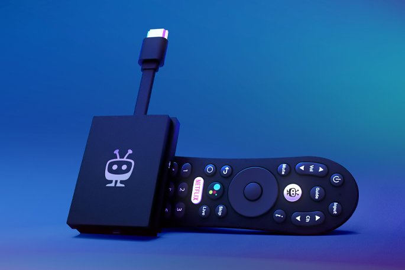

# Chromecast compatibility

Google has made several different versions of it's Chromecast line of devices.
Additionally, other companies have released similar devices that support the
Chromecast protocol. The table below summarizes their support status in {{ WR
}}:

## First generation

:material-check-circle:{ .green } &ndash; Working

-----

{ width=320 height=240 }

Image attribution: [© Raimond Spekking / CC BY-SA 4.0](https://en.wikipedia.org/wiki/File:Chromecast_(1st_generation)-0869.jpg)

## Second generation

:material-sign-caution:{ .yellow } &ndash; Untested, but should work

-----

{ width=306 height=240 }

Image attribution: [© Y2kcrazyjoker4 / CC BY-SA 4.0](https://en.wikipedia.org/wiki/File:Chromecast-2015.jpg)

## Third generation

:material-check-circle:{ .green } &ndash; Working

-----

{ width=240 height=240 }

Image attribution: [© Qurren / CC BY-SA 4.0](https://en.wikipedia.org/wiki/File:Chromecast_(3rd_generation).jpg)

## Chromecast w/ Google TV

<!-- markdownlint-disable-next-line MD051 -->
:material-wrench:{ .red } &ndash; [Configuration required](#config-ccwtgv)

-----

{ width=320 height=213 }

Image attribution: [© Y2kcrazyjoker4 / CC BY-SA 4.0](https://en.wikipedia.org/wiki/File:Chromecast-with-Google-TV-snow-color-on-wood-table2.jpg)

## TiVo Stream 4K

:material-check-circle:{ .green } &ndash; Working

-----

{ width=240 height=240}

Image attribution: [© Xperi Inc.](https://www.tivo.com/products/stream-4k)

## Required configuration changes

### Chromecast w/ Google TV { #config-ccwtgv }

In their default configuration, the Chromecast w/ Google TV devices will timeout
after 10 minutes and return to "ambient mode." To prevent this, a few settings
must be changed:

1. Disable power saving
    - Go to Settings (:material-cog: icon) :material-chevron-right: System
      :material-chevron-right: Power & Energy
    - Set "Turn off display" to "Never"

1. Enable "developer mode"

    - Go to Settings (:material-cog: icon) :material-chevron-right: System
      :material-chevron-right: About
    - Scroll down to "Android TV OS Build" and repeatedly click on it until
        the message "You are now a developer" appears

1. Enable "Stay awake"

    - Go to Settings (:material-cog: icon) :material-chevron-right: System
      :material-chevron-right: Developer options
    - Enable "Stay awake"
