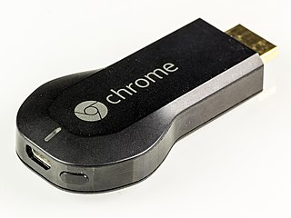
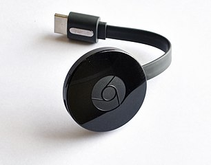
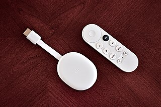

# Chromecast compatibility

Google has made several different versions of it's Chromecast line of devices.
The table below summarizes their support status in {{ WR }}:

<table markdown>
<tr markdown>
<td align="center" markdown="block">
**First generation**  
Working :white_check_mark:

-----

{loading=lazy}  
Image attribution: [© Raimond Spekking / CC BY-SA 4.0](https://en.wikipedia.org/wiki/File:Chromecast_(1st_generation)-0869.jpg)
</td>
<td align="center" markdown="block">
**Second generation**  
Untested, but should work :fingers_crossed:

-----

{loading=lazy}  
Image attribution: [© Y2kcrazyjoker4 / CC BY-SA 4.0](https://en.wikipedia.org/wiki/File:Chromecast-2015.jpg)
</td>
</tr>
<tr markdown>
<td align="center" markdown="block">
**Third generation**  
Working :white_check_mark:

-----

{loading=lazy}  
Image attribution: [© Qurren / CC BY-SA 4.0](https://en.wikipedia.org/wiki/File:Chromecast_(3rd_generation).jpg)
</td>
<td align="center" markdown="block">
**Chromecast w/ Google TV**  
[Configuration required](#chromecast-w-google-tv) :warning:

-----

{loading=lazy}  
Image attribution: [© Y2kcrazyjoker4 / CC BY-SA 4.0](https://en.wikipedia.org/wiki/File:Chromecast-with-Google-TV-snow-color-on-wood-table2.jpg)
</td>
</tr>
</table>

## Required configuration changes

### Chromecast w/ Google TV

In their default configuration, the Chromecast w/ Google TV devices will timeout
after 10 minutes and return to "ambient mode." To prevent this, a few settings
must be changed:

1. Disable power saving
    - Go to Settings (:gear: icon) :material-chevron-right: System
      :material-chevron-right: Power & Energy
    - Set "Turn off display" to "Never"

1. Enable "developer mode"

    - Go to Settings (:gear: icon) :material-chevron-right: System
      :material-chevron-right: About
    - Scroll down to "Android TV OS Build" and repeatedly click on it until
        the message "You are now a developer" appears

1. Enable "Stay awake"

    - Go to Settings (:gear: icon) :material-chevron-right: System
      :material-chevron-right: Developer options
    - Enable "Stay awake"
