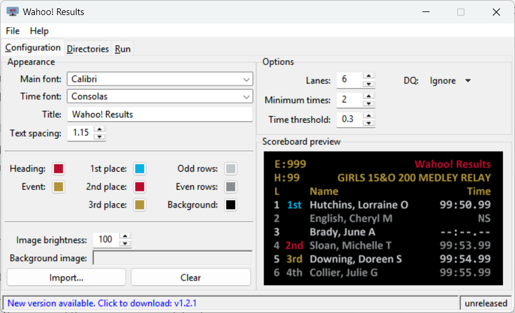
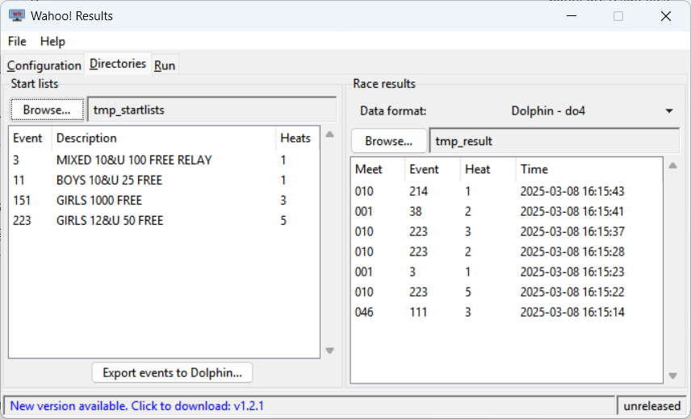
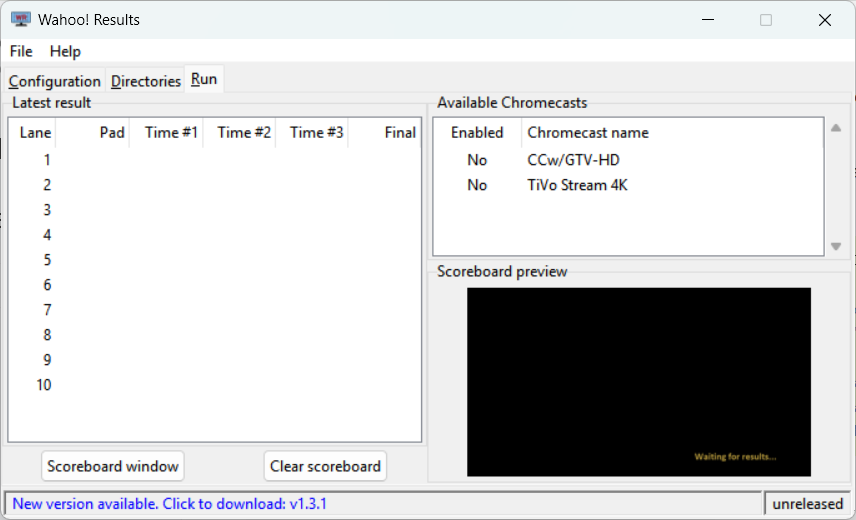

# Configuration

This page provides detailed information about how to configure {{ WR }}. If you
just want to get started with a minimal configuration, see the [quickstart
page](quickstart.md).

The application is divided into three main tabs:

[Configuration](#configuration-tab)

:   The configuration tab is used to set basic configuration information as well
    as adjust the color theme of the scoreboard.

[Directories](#directories-tab)

:   The directories tab allows configuring the directories where start lists and
    race results will be found.

[Run](#run-tab)

:   The run tab is the main tab for monitoring the scoreboard during a meet. It
    allows choosing which Chromecast devices will be used. It also provides a
    live view of the scoreboard and detailed information about the most recent
    race results.

## Configuration tab

{width=50% align=right loading=lazy}

The left side of the configuration tab allows customizing the appearance of
the scoreboard.

Main font

:   This is the font that will be used for the majority of the scoreboard
    text.

Time font

:   This font is used for displaying the swimmers' times. It is recommended
    that a fixed-width (monospaced) font is used for displaying times to
    ensure the times (minutes, seconds, and hundredths) line up properly.

Title

:   This is a free-form text field that is displayed at the top of the
    scoreboard. Customize this with the name of the meet, session number, or
    other information.

Text spacing

:   This controls the amount of vertical space between lines of text.

Text colors

:   The colors can be customized by clicking on the color swatches and choosing
    a new color.

Background image

:   A background image can be inserted using the ++"Import..."++ button. The image
    should be a 1280x720 PNG image. Once imported, the "image brightness"
    adjustment can be used to dim the image if it is too bright.

-----

On the right side of the window are various options for controlling how the
scoreboard displays times.

Lanes

:   This is the number of lanes that will be displayed: (6 &ndash; 10).

Minimum times

:   This determines the minimum number of watch (Dolphin) times that need to
    be available to calculate a final time for the lane. Lanes that fail to
    have at least this many individual times will display `--:--.--` instead
    of a final time.

Time threshold

:   If an individual watch time differs from the calculated final time by more
    than this threshold (in seconds), the scoreboard will display `--:--.--`
    instead of the calculated final time.

The "Minimum times" and "Time threshold" settings are designed to prevent
potentially unreliable or incorrect times from being shown to spectators.

{{ CLEARFLOAT }}

## Directories tab

{width=50% align=right loading=lazy}

The Directories tab configures where the scoreboard will search for start list
(`*.ECB`) files and race result (`*.DO4`) files.

The left pane is for the start list files. Use the ++"Browse..."++ button to
select the directory where the start lists reside. The start list files will be
parsed and summarized in the table.

The ++"Export events to Dolphin..."++ button will generate a
`dolphin_events.csv` file in the start list directory that is suitable for
import into the Dolphin software.

The right pane is for race result files. Use the ++"Browse..."++ button to
select the directory where the race result files will be written by the Dolphin
software. Any race result files that are found will be displayed in the table,
ordered by their timestamp.

{{ CLEARFLOAT }}

## Run tab

{width=50% align=right loading=lazy}

The Run tab shows live results as the scoreboard is updated.

On the left is a table showing the individual watch times and calculated final
time for each lane.

On the right the Chromecast selector that shows a list of all Chromecasts that
have been discovered on the network. Clicking on a row toggles whether the
scoreboard will send results to that Chromecast (enabled).

At the bottom is a preview of the current scoreboard. This image is a copy of
what is currently being sent to the enabled Chromecast devices.
