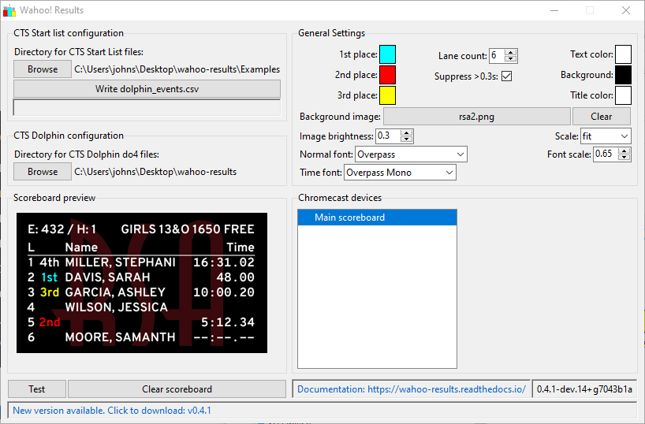
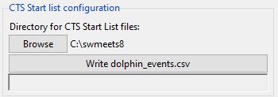
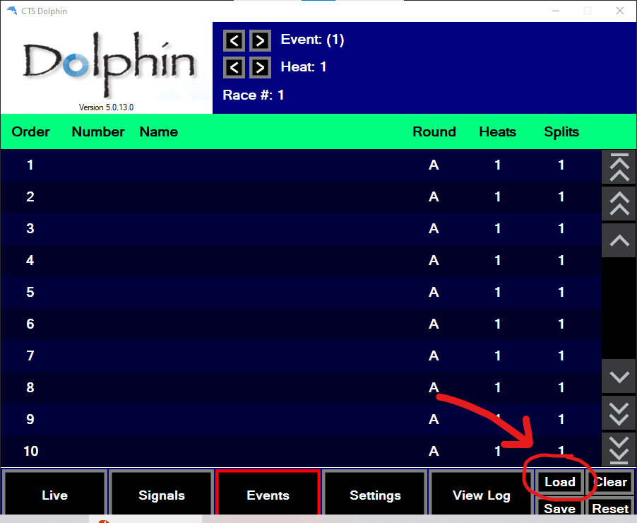
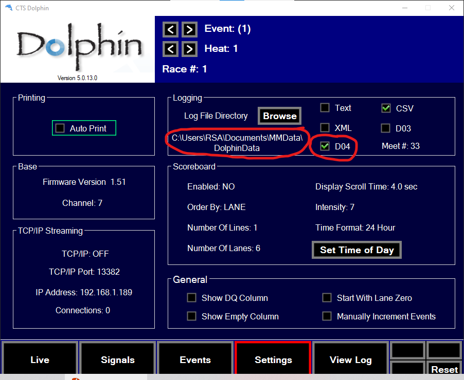
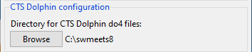
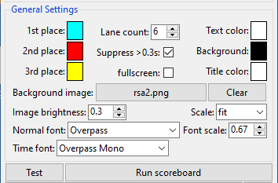

.. include:: common.rst
=============
Configuration
=============

The main window allows configuring the scoreboard and monitoring the latest results that are being transmitted.

   Main window

|clearfloat|

Start list configuration
========================

The first step in configuring |wr| is to obtain the start list files.

Creating start list files
-------------------------

The start lists used by |wr| are the same as the files that are used for
scoreboards run by a Colorado System 6 or similar system. In Meet Manager,
they can be created by selecting:

    File > Export > Start Lists for Scoreboard > Start Lists for CTS |br|
    `(Click here for an example) <_static/media/mm_startlist_export.png>`_

The above command will create a series of files named ``E<###>.scb``, one for
each event in the session(s) that were exported. The start lists should all be
placed into a directory that |wr| will be able to access.

.. _set_start_list_dir:

Selecting the start list directory
----------------------------------

The top left section of the configuration screen is used to select the
directory where the start lists have been saved. Click the "Browse" button and
navigate to the appropriate directory. Once chosen, the directory path will
appear on the right.

After choosing the directory, click the "Write dolphin_events.csv" button.
This reads all the start lists and creates a list of events, heats, and
descriptions that can be imported into the CTS Dolphin software. The status
line below the button will update with the number of events that were
found/processed. For example:

    Wrote 24 events to dolphin_events.csv

|clearfloat|

This ``dolphin_events.csv`` file can now be imported into the Dolphin software
(on the Events screen). It will provide the event numbers, descriptions, and
number of heats for each event. **Having the correct event and heat number in
the Dolphin software is required for the scoreboard to correctly recognize the
race results.**

In the Dolphin software, navigate to the "Events" screen and click "Load."
Select the ``dolphin_events.csv`` that was just created in the start list
directory. This will populate the event screen with all the events and their
heat counts.

|clearfloat|

Dolphin configuration
=====================

The second step is to configure the Dolphin software and tell |wr| where to
find the race results.

.. _config_dolphin_sw:

Dolphin software
----------------

In order to obtain the race results, |wr| needs to be able to read the data
files that are generated by the Dolphin software. Dolphin must be configured
to produce ``DO4`` result files (aka results with splits). The split times
themselves do not need to be captured and are not actually used. If you do not
normally use ``DO4`` files, multiple file formats can be enabled in the
Dolphin software.

Also make a note of the log directory that is being used. This is where the
result files will be written, and |wr| needs to be able to locate them.

|clearfloat|

.. _set_results_dir:

Setting the results directory
-----------------------------

In |wr|\ , the Dolphin's logging directory needs to be selected. Click on the
"Browse" button and navigate to the logging directory noted above. The chosen
directory will appear next to the button once selected.

|clearfloat|

General options
===============

The upper-right section of the configuration screen is used to set the general
options that control the look of the scoreboard. When customizing options,
click the "Test" button to display a sample scoreboard in the chosen style.

Below is an explanation of each option. Tooltips are also available in the
application by hovering over any item.

1st, 2nd, and 3rd place colors
    By clicking on the color swatch next to each of these, the color of the
    "1st", "2nd", and "3rd" place markers can be configured.
Lane count
    Sets the number of lanes to display on the scoreboard.
Suppress >0.3s
    When this option is selected, if the minimum and maximum individual times
    received for a lane differ by more than 0.3s, the time for that lane will
    not be displayed. The displayed result will be "--:--.--" instead. This
    prevents showing results where there may have been a timing anomoly.
Text, background, and title colors
    Clicking on the corresponding color swatch allows customizing the color
    for each of these items.
Background image
    An image can be selected to display behind the results. The currently
    selected image is shown on the button. The selection can be cleared by
    pressing the "Clear" button.

    When selecting a background image, keep in mind that any transparent areas
    of the image will be replaced by the solid background color (above
    option).
Image brightness
    This allows decreasing the brightness of the background image so that the
    scoreboard results are easier to read.
Scale
    This adjusts how the background image is scaled to fit on the scoreboard.
    There are four options:

    - None: The image is not scaled; it is used as-is.
    - Cover: The image is uniformly scaled so that the **smallest** dimension
      fills the screen (i.e., the image will fully "cover" the screen).
    - Fit: The image is uniformly scaled so that the **largest** dimension
      fills the screen (i.e., the image will "fit" within the screen).
    - Stretch: The image is non-uniformly scaled so that the image fully fills
      the screen yet still fits within it.
Normal font & Time font
    These select the font that will be used for displaying the text on the
    scoreboard. Any font that is installed on the computer may be used.

    It is suggested that a monospaced font be used for the time font so that
    the result times align vertically on the scoreboard (i.e., all the ":" and
    "." separators line up vertically).
Font scale
    The size of the fonts are automatically chosen based on the size of the
    scoreboard window and the number of lanes. This scale parameter controls
    the amount of "whitespace" that is left between scoreboard lines. Choosing
    a larger scale factor will produce larger text, but it can also lead to
    the scoreboard text looking "crowded."

Chromecast selection
====================

The lower-right of the window displays the names of all the Google Chromecast devices that have been discovered on the local network. Select one or more of these devices to enable them. You may need to <ctrl>-click or <shift>-click to adjust the selection. The selected Chromecast devices should immediately begin displaying the latest scoreboard image.

Preview window
==============

The lower-left of the main window contains a preview of what is currently being broadcast to the enabled Chromecast devices. The "test" and "clear" buttons just below this preview image can be used to send test data or clear the currently displayed results.