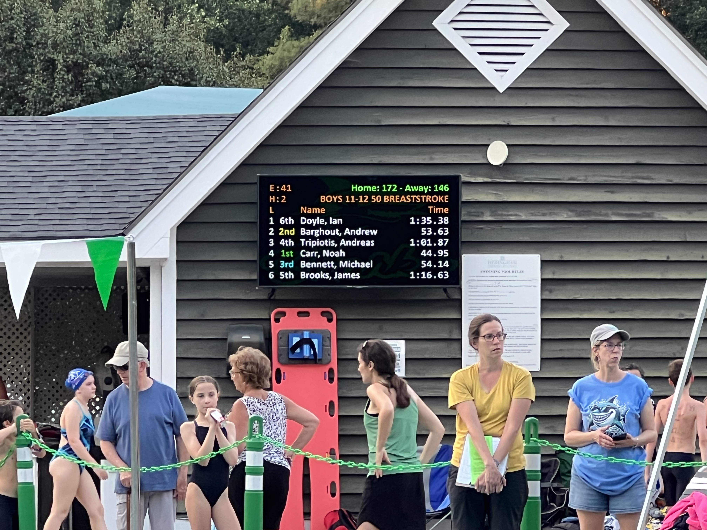

# {{ WR }} in action

Is your team using {{ WR }}?

---

Email <thanks@wahoo-results.com> with:

- The **name** of your team/facility
- a **picture** of the scoreboard in action
- a **link** to your team website or social media page (optional)

... and I'll add it here!

<!-- markdownlint-disable MD013 -->

<figure markdown>
{ width=4032 height=3024 }
<figcaption markdown>[Hedingham Sharks](https://www.hedinghamsharks.com/) &ndash; Raleigh, NC</figcaption>
</figure>

