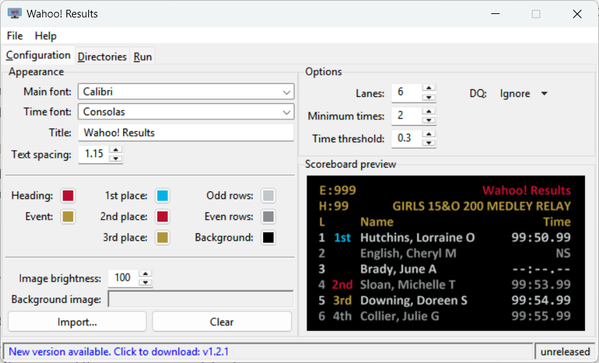
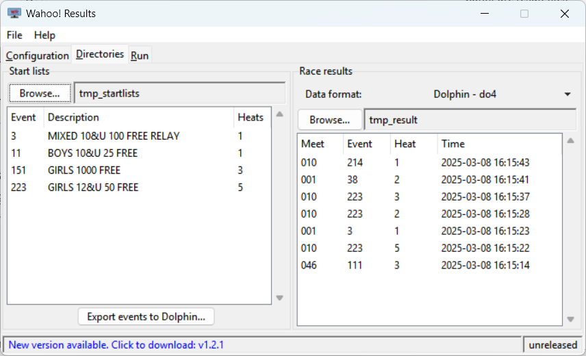
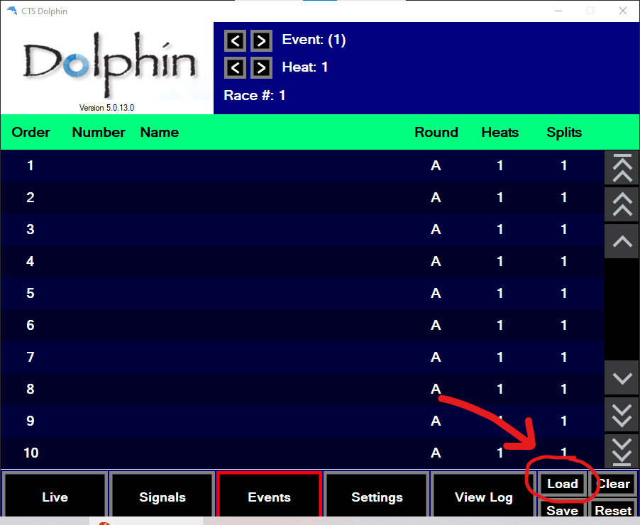
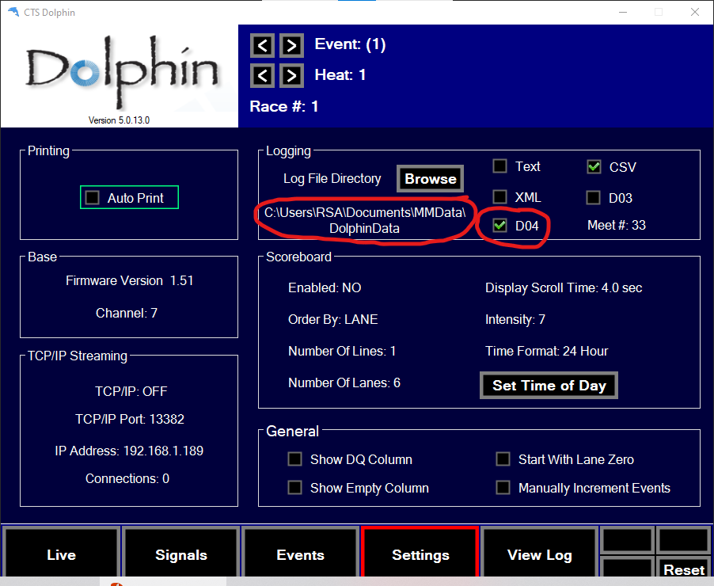
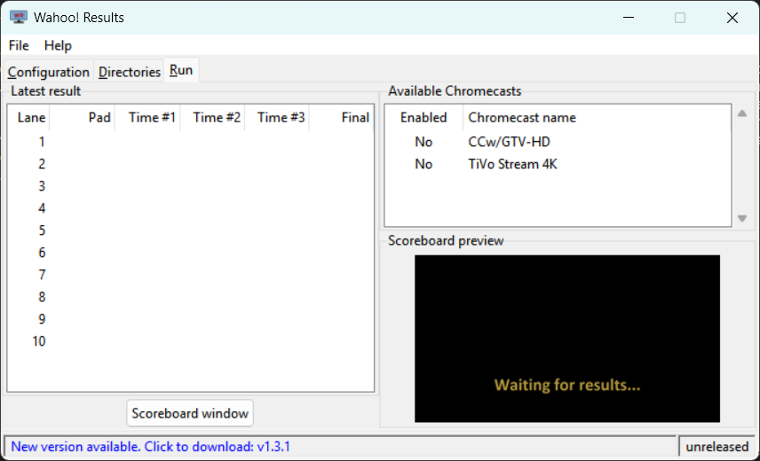

# Quickstart

Follow this quickstart guide to get started with the scoreboard. It covers
installation and the minimal steps required to display race results. Advanced
configuration, such as theming, is covered elsewhere.

## Installation

As a first step, download the latest release from the [download
page](download.md).

Once you have downloaded the scoreboard executable, start it.

The first time you run the program, you may receive a warning about it being an
"unknown application". Go ahead and run it anyway.

You will also receive a warning from Windows Firewall about allowing {{ WR }} to
listen for incoming connections. It is necessary to grant this permission so
that the Chromecast devices will be able to fetch the scoreboard images.

## Set the number of lanes

{ width=685 height=416 .rfloat }

The first screen that comes up will be the "Configuration" tab. For now, the
only setting to change is the number of lanes that are displayed.

On the right side, set "Lanes" to the number of lanes in your pool. The preview
image in the lower right will update to show an example of how the scoreboard
will look.

{{ CLEARFLOAT }}

## Create start lists

The next thing to do is export the "start lists" from your meet management
software. The start lists used by {{ WR }} are the same as those for Colorado
scoreboards. They contain information about each event and the names of the
swimmers in each heat.

=== "Meet Manager"

    <!-- markdownlint-disable-line MD046 -->
    In Meet Manager, start lists can be created by selecting:

    File > Export > Start Lists for Scoreboard > Start Lists for CTS
    [(example)](images/mm_startlist_export.png)

=== "Meet Maestro"

    <!-- markdownlint-disable-line MD046 -->
    The desktop version of Meet Maestro (free from Swimtopia's web site)
    is required to generate the start list files. They cannot be exported
    by the web version currently.

    To export the start lists:

    Settings (gear icon in the upper right) > Timing Setup > Scoreboards >
    "Export start lists for CTS" [(example)](images/MaestroStartListExport.png)

-----

The above steps will create a series of files named `E<###>.scb`, one for each
event in the session(s) that were exported. The start lists should all be placed
into a directory that {{ WR }} will be able to access.

## Set the start list directory

<!-- markdownlint-disable-next-line MD013 -->
{ width=685 height=416 .rfloat loading=lazy }

Now you will tell {{ WR }} where to find the start list files.

Switch back to the {{ WR }} application and go to the "Directories" tab. The
left side is where you set the location for the start list files.

Click "Browse" and navigate to the directory where you saved the start lists in
the previous step.

{{ WR }} will read all the start lists and summarize them in the window. It will
list the event number, description, and the number of heats in each event.

If this looks good, press the "Export events to Dolphin..." button. This will
write a `dolphin_events.csv` file into the start list directory. This file
contains the event data for the Dolphin timing software.

{{ CLEARFLOAT }}

## Import the event file

<!-- markdownlint-disable-next-line MD013 -->
{ width=902 height=740 .rfloat loading=lazy }

You will now load the event list into the Dolphin software. It will provide the
event numbers, descriptions, and number of heats for each event. **Having the
correct event and heat number in the Dolphin software is required for the
scoreboard to correctly recognize the race results.**

In the Dolphin software, navigate to the "Events" screen and click "Load."
Select the `dolphin_events.csv` that you just created. This will populate the
event screen with all the events and their heat counts.

{{ CLEARFLOAT }}

## Configure result files

<!-- markdownlint-disable-next-line MD013 -->
{ width=902 height=740 .rfloat loading=lazy }

Still in the Dolphin software, switch to the "Settings" screen. Here, you will
configure the location and type of race results the Dolphin software will
generate.

{{ WR }} reads race results from Dolphin `DO4` files, so ensure that format is
enabled. It's fine to enable other formats as well.

Make a note of the log directory that is being used. This is where the result
files will be written. You will configure {{ WR }} with this directory in the
next step.

{{ CLEARFLOAT }}

## Set the results directory

You will now set the location where {{ WR }} will look for race results.

Switch back to the {{ WR }} program, still in the "Directories" tab. The right
side of the window is for race results.

Click "Browse..." and navigate to the "Log file directory" that was set in the
Dolphin software.

In the right half of the window, any existing race results that are found will
be displayed. The race results are ordered by time.

## Connect Chromecast(s)

{ width=685 height=416 .rfloat loading=lazy }

The final step is to connect the Chromecast devices that will be used to display
the scoreboard.

Switch to the "Run" tab.

In the upper right of the screen is a window that will display the name of all
the Chromecast devices on your network.

Click on a device to enable it. The Enabled column will switch to "Yes", and the
Chromecast display should match the preview in the lower right.

## Go!

You should be all set...

As new race results are written by the Dolphin software, the results will be
detected, and the scoreboard will automatically update with the names and times
from the race.
