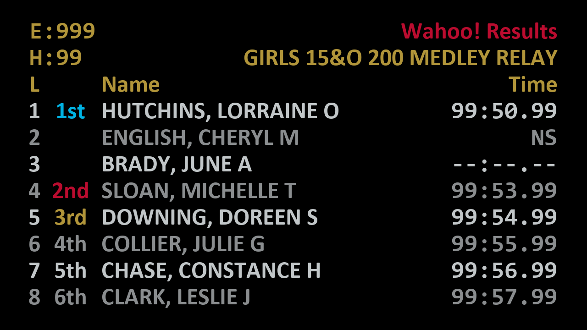

.. include:: ../common.rst
====================================
Setting custom colors and background
====================================

.. toctree::
  :hidden:

.. sidebar:: Contents

  .. contents:: Basic theming
    :local:

This tutorial walks you through the process of creating a custom theme for the
|wr| scoreboard. By creating a custom theme, you can tailor the scoreboard to
fit your team's colors or the event's theme.

For this tutorial, you will create a theme that loosely follows the `USA
Swimming style guide
<https://www.usaswimming.org/about-usas/resources/marketing-resources>`_. Feel
free to substitute your own colors and images to create a theme that fits your
needs.

Set the number of lanes
=======================

The first step is to set the number of lanes that will be displayed on the
scoreboard. Launch the |wr| program and make sure you are on the
:guilabel:`Configuration` tab. On the right side, adjust the :guilabel:`Lanes`
option to match the number of lanes in your pool

Choose the fonts
================

Now that you have the number of lanes set, you can choose the fonts that will be
used for the scoreboard. The |wr| scoreboard uses two fonts: one for the main
text and one for the times.

First, you should select a font for the main text. Click the :guilabel:`Main
font` dropdown and select a font. Choose **Calibri** for this tutorial; it is a
`sans-serif <https://en.wikipedia.org/wiki/Sans-serif>`_ font. Those tend to be
easier to read from a distance.

For the time font, you should choose a `monospace font
<https://en.wikipedia.org/wiki/Monospaced_font>`_ to ensure the times line up
vertically. Click the :guilabel:`Time font` dropdown and select a font. Go ahead
and select **Consolas** for this tutorial.

Determine the text spacing
==========================

Now that you have the fonts selected, you need to determine how much space to
leave between the lines of text. This is important because the text needs to be
large enough to be read from a distance, but not so large that the display looks
crowded.

The :guilabel:`Text spacing` option controls the amount of space between the
lines of text. Based on the fonts you selected, set the spacing to **1.1**.

Select a color pallette
=======================

Now that you have the fonts and spacing set, it's time to choose the colors for
the scoreboard. The colors used here are based on the USA Swimming style guide,
but you can substitute your own colors. If you need help selecting a color
pallette to use, check out `Coolors <https://coolors.co/>`_.

Here are some of the colors from the USA Swimming style guide:

.. hlist::
   :columns: 2

   * Black: :raw-html:`R:0 G:0 B:0`
   * Light gray: :raw-html:`R:193 G:198 B:200`
   * Dark gray: :raw-html:`R:138 G:141 B:143`
   * Red: :raw-html:`R:186 G:12 B: 47`
   * Light blue: :raw-html:`R:0 G:179 B:228`
   * Gold: :raw-html:`R:177 G:149 B:58`

Beneath the font and spacing options, you will see a section that contains the
colors used by the scoreboard. Click on the color swatch next to each item to
bring up the color chooser. Within the chooser, the values for the red, green, and blue components can be entered directly on the right side.

Select the following colors:

.. hlist::
   :columns: 2

   * :guilabel:`Heading`: Red (R:186 G:12 B:47)
   * :guilabel:`Event`: Gold (R:177 G:149 B:58)
   * :guilabel:`1st place`: Light blue (R:0 G:179 B:228)
   * :guilabel:`2nd place`: Red (R:186 G:12 B:47)
   * :guilabel:`3rd place`: Gold (R:177 G:149 B:58)
   * :guilabel:`Odd rows`: Light gray (R:193 G:198 B:200)
   * :guilabel:`Even rows`: Dark gray (R:138 G:141 B:143)
   * :guilabel:`Background`: Black (R:0 G:0 B:0)

Clear the background image
==========================

Now that the colors are set, you need to clear the background image. Click the
:guilabel:`Clear` button in the background image section to clear any image that
may be set.

   Styled scoreboard

After following the above steps, you should have a scoreboard that looks like the one shown here.

Once you have the scoreboard looking the way you want, you may want to create a
background image. This is covered in the :doc:`simple-bg` tutorial.
